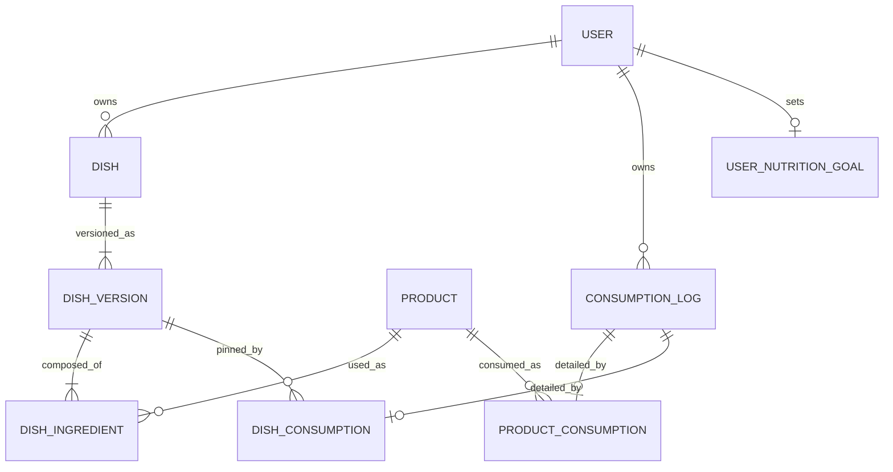

# Calorie Tracker en recepten ERD — doelmodel

Dit document beschrijft consumptielogs, doelen en de gedeelde persistente recept-/gerechtdata. Catalogusdata staat in [PRODUCT_ERD.md](./PRODUCT_ERD.md). In de backend blijft `dish` de technische naam; de recepten-app presenteert hetzelfde object als `recept` en de Calorie Tracker als `gerecht`.

```yaml
dish
    id: uuid PK
    user_id: uuid FK -> user.id NOT NULL
    name: text NOT NULL
    visibility: enum(PRIVATE, PUBLIC) NOT NULL DEFAULT PRIVATE
    created_at: timestamp with time zone NOT NULL
    updated_at: timestamp with time zone NOT NULL
    archived_at: timestamp with time zone NULL

    UNIQUE INDEX (user_id, lower(trim(name))) WHERE archived_at IS NULL

dish_version
    id: uuid PK
    dish_id: uuid FK -> dish.id NOT NULL
    servings: decimal NOT NULL
    instructions: text NULL
    created_at: timestamp with time zone NOT NULL
    CHECK (servings > 0)

    # Immutable; updates to ingredients, quantities, servings or instructions
    # create a new version.

dish_ingredient
    id: uuid PK
    dish_version_id: uuid FK -> dish_version.id NOT NULL
    product_id: uuid FK -> product.id NOT NULL
    quantity: decimal NOT NULL
    input_mode: enum(FULL_PRODUCT, PRODUCT_PORTION, CONTENT_UNIT) NOT NULL
    input_unit_type_id: int FK -> unit_type.id NULL

    CHECK (quantity > 0)
    CHECK (
        (input_mode = CONTENT_UNIT AND input_unit_type_id IS NOT NULL) OR
        (input_mode IN (FULL_PRODUCT, PRODUCT_PORTION) AND input_unit_type_id IS NULL)
    )

consumption_log
    id: uuid PK
    user_id: uuid FK -> user.id NOT NULL
    type: enum(PRODUCT, DISH) NOT NULL
    consumed_at: timestamp with time zone NOT NULL
    timezone: text NOT NULL
    created_at: timestamp with time zone NOT NULL
    updated_at: timestamp with time zone NOT NULL
    deleted_at: timestamp with time zone NULL
    INDEX (user_id, consumed_at)

product_consumption
    consumption_log_id: uuid PK FK -> consumption_log.id ON DELETE CASCADE
    product_id: uuid FK -> product.id NOT NULL
    quantity: decimal NOT NULL
    input_mode: enum(FULL_PRODUCT, PRODUCT_PORTION, CONTENT_UNIT) NOT NULL
    input_unit_type_id: int FK -> unit_type.id NULL
    CHECK (quantity > 0)

dish_consumption
    consumption_log_id: uuid PK FK -> consumption_log.id ON DELETE CASCADE
    dish_version_id: uuid FK -> dish_version.id NOT NULL
    quantity: decimal NOT NULL
    CHECK (quantity > 0)

user_nutrition_goal
    user_id: uuid PK FK -> user.id
    calories_kcal: int NULL
    protein_g: decimal NULL
    carbohydrates_g: decimal NULL
    fat_g: decimal NULL
    created_at: timestamp with time zone NOT NULL
    updated_at: timestamp with time zone NOT NULL

    CHECK (calories_kcal IS NULL OR calories_kcal > 0)
    CHECK (protein_g IS NULL OR protein_g > 0)
    CHECK (carbohydrates_g IS NULL OR carbohydrates_g > 0)
    CHECK (fat_g IS NULL OR fat_g > 0)
```

## Relaties



Voedingswaarden worden niet gesnapshot. Een log pint wel de receptstructuur via `dish_version`, maar berekent voedingswaarden met het actuele `product_macro_profile` van ieder ingrediënt. Cataloguscorrecties werken daardoor direct door in recepten, historische logs en statistieken.
