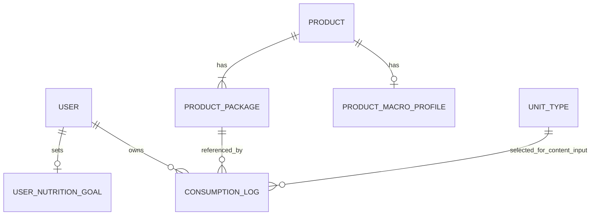

# Calorie Tracker ERD

<!--
Documentatieregel: houd ERD's beperkt tot persistente tabellen, relaties en harde databaseconstraints.
Domeinregels, UI-gedrag, endpointcontracten en rationale horen in specs of domeindocs; verwijs hier alleen kort wanneer dat nodig is.
-->

Dit document beschrijft de persistente gegevens voor voedingswaarden, persoonlijke doelen en consumptielogs. Domeinregels staan in [calorie-tracker-domeinregels.md](../../domein/calorie-tracker-domeinregels.md). Product-, verpakkings- en eenheidsgegevens komen uit de gedeelde productcatalogus in [PRODUCT_ERD.md](./PRODUCT_ERD.md).

## Tabellen

```yaml
product_macro_profile
    product_id: uuid PK FK -> product.id
    reference_basis: enum(PER_100_G, PER_100_ML, PER_UNIT) NOT NULL
    calories_kcal: decimal NULL
    protein_g: decimal NULL
    carbohydrates_g: decimal NULL
    fat_g: decimal NULL
    calories_source: enum(AUTOMATIC, MANUAL) NULL
    created_at: timestamp with time zone NOT NULL
    updated_at: timestamp with time zone NOT NULL

    CHECK (calories_kcal IS NULL OR calories_kcal >= 0)
    CHECK (protein_g IS NULL OR protein_g >= 0)
    CHECK (carbohydrates_g IS NULL OR carbohydrates_g >= 0)
    CHECK (fat_g IS NULL OR fat_g >= 0)

    # At least one stored nutritional value must be greater than zero.
    CHECK (
        COALESCE(calories_kcal, 0) > 0 OR
        COALESCE(protein_g, 0) > 0 OR
        COALESCE(carbohydrates_g, 0) > 0 OR
        COALESCE(fat_g, 0) > 0
    )

    # A calorie source exists exactly when calories are stored.
    CHECK (
        (calories_kcal IS NULL AND calories_source IS NULL) OR
        (calories_kcal IS NOT NULL AND calories_source IS NOT NULL)
    )

consumption_log
    id: uuid PK
    user_id: uuid FK -> user.id NOT NULL
    product_package_id: uuid FK -> product_package.id NOT NULL
    quantity: decimal NOT NULL
    input_mode: enum(PACKAGE, INDIVIDUAL_UNIT, CONTENT_UNIT) NOT NULL
    input_unit_type_id: int FK -> unit_type.id NULL
    consumed_at: timestamp with time zone NOT NULL
    timezone: text NOT NULL
    created_at: timestamp with time zone NOT NULL
    updated_at: timestamp with time zone NOT NULL
    deleted_at: timestamp with time zone NULL

    CHECK (quantity > 0)

    # input_unit_type_id is stored only for explicit content-unit input.
    CHECK (
        (input_mode = CONTENT_UNIT AND input_unit_type_id IS NOT NULL) OR
        (input_mode IN (PACKAGE, INDIVIDUAL_UNIT) AND input_unit_type_id IS NULL)
    )

    INDEX (user_id, consumed_at)
    INDEX (product_package_id)
    INDEX (deleted_at) WHERE deleted_at IS NOT NULL

user_nutrition_goal
    user_id: uuid PK FK -> user.id
    calories_kcal: int NULL
    protein_g: decimal NULL
    carbohydrates_g: decimal NULL
    fat_g: decimal NULL
    created_at: timestamp with time zone NOT NULL
    updated_at: timestamp with time zone NOT NULL

    CHECK (calories_kcal IS NULL OR calories_kcal > 0)
    CHECK (protein_g IS NULL OR protein_g > 0)
    CHECK (carbohydrates_g IS NULL OR carbohydrates_g > 0)
    CHECK (fat_g IS NULL OR fat_g > 0)
```

## Relaties



## Catalogusafhankelijkheden

De catalogustabellen staan in [PRODUCT_ERD.md](./PRODUCT_ERD.md). Gedeelde regels voor selecteerbaarheid, eenheden, macroprofielen en cataloguscorrecties staan in [productcatalogus-domeinregels.md](../../domein/productcatalogus-domeinregels.md).

## Domeinregels

Berekeningen, lokale kalenderdagen, retrygedrag en bewaarbeleid staan in [calorie-tracker-domeinregels.md](../../domein/calorie-tracker-domeinregels.md).
