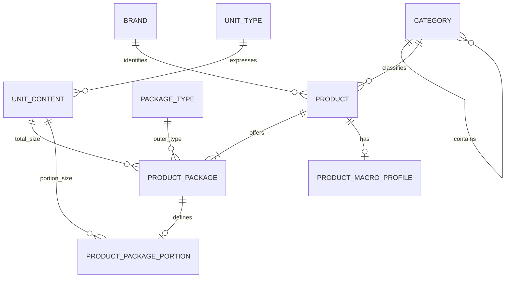

# Productcatalogus ERD

<!--
Documentatieregel: houd ERD's beperkt tot persistente tabellen, relaties en harde databaseconstraints.
Domeinregels, UI-gedrag, endpointcontracten en rationale horen in specs of domeindocs; verwijs hier alleen kort wanneer dat nodig is.
-->

Dit document beschrijft de persistente structuur van de gedeelde productcatalogus. Domeinregels staan in [productcatalogus-domeinregels.md](../../domein/productcatalogus-domeinregels.md). Calorie Tracker-logs en persoonlijke doelen staan in [CALORY_TRACKER_ERD.md](./CALORY_TRACKER_ERD.md).

```yaml
brand
    id: uuid PK
    name: text NOT NULL

    # Preserve the original display name, but prevent case/trim duplicates.
    UNIQUE (lower(trim(name)))

category
    id: int PK
    parent_id: int FK -> category.id NULL
    name: text NOT NULL

    # Category names are unique among siblings, case-insensitive after trim.
    # Use database-specific partial/expression indexes so nullable parent_id
    # behaves correctly.
    UNIQUE (parent_id, lower(trim(name))) WHERE parent_id IS NOT NULL
    UNIQUE (lower(trim(name))) WHERE parent_id IS NULL

unit_type
    id: int PK autoincrement
    name: text NOT NULL
    symbol: text NOT NULL
    dimension: enum(MASS, VOLUME, COUNT) NOT NULL
    conversion_to_base: decimal NOT NULL

    # Reference data is seeded or managed by an administrator. Base units are
    # gram for MASS, millilitre for VOLUME, and one item/dose for COUNT.
    CHECK (conversion_to_base > 0)
    UNIQUE (lower(trim(name)))
    UNIQUE (lower(trim(symbol)))

unit_content
    id: int PK autoincrement
    unit_type_id: int FK -> unit_type.id NOT NULL
    amount: decimal NOT NULL

    # Decimal values are canonicalized before insert/find-or-create, so 1.5,
    # 1.50, and 01.500 refer to the same content amount.
    CHECK (amount > 0)
    UNIQUE (unit_type_id, amount)

package_type
    id: int PK autoincrement
    name: text NOT NULL

    # Reference data is seeded or managed by an administrator.
    UNIQUE (lower(trim(name)))

product
    id: uuid PK
    name: text NOT NULL
    category_id: int FK -> category.id NOT NULL
    brand_id: uuid FK -> brand.id NULL
    consumption_type: enum(FOOD, DRINK, SUPPLEMENT) NOT NULL
    archived_at: timestamp with time zone NULL
    created_at: timestamp with time zone NOT NULL
    updated_at: timestamp with time zone NOT NULL

    # Preserve the product display name, but detect duplicates after trim and
    # case normalization. Use partial indexes for nullable brand_id.
    UNIQUE (brand_id, category_id, lower(trim(name))) WHERE brand_id IS NOT NULL
    UNIQUE (category_id, lower(trim(name))) WHERE brand_id IS NULL

product_package
    id: int PK autoincrement
    product_id: uuid FK -> product.id NOT NULL
    unit_content_id: int FK -> unit_content.id NOT NULL
    package_type_id: int FK -> package_type.id NOT NULL
    archived_at: timestamp with time zone NULL
    created_at: timestamp with time zone NOT NULL
    updated_at: timestamp with time zone NOT NULL

    # unit_content_id always represents the complete package content.
    UNIQUE (product_id, package_type_id, unit_content_id)

product_package_portion
    product_package_id: int PK FK -> product_package.id ON DELETE CASCADE
    name: text NOT NULL
    unit_content_id: int FK -> unit_content.id NOT NULL
    portions_per_package: int NULL

    # The portion amount is explicit and independent from complete package
    # content. Rounded label values therefore do not have to multiply exactly
    # to the complete package amount.
    CHECK (length(trim(name)) > 0)
    CHECK (portions_per_package IS NULL OR portions_per_package > 0)

product_macro_profile
    product_id: uuid PK FK -> product.id
    reference_basis: enum(PER_100_G, PER_100_ML, PER_UNIT) NOT NULL
    calories_kcal: decimal NULL
    protein_g: decimal NULL
    carbohydrates_g: decimal NULL
    fat_g: decimal NULL
    calories_source: enum(AUTOMATIC, MANUAL) NULL
    created_at: timestamp with time zone NOT NULL
    updated_at: timestamp with time zone NOT NULL

    CHECK (calories_kcal IS NULL OR calories_kcal >= 0)
    CHECK (protein_g IS NULL OR protein_g >= 0)
    CHECK (carbohydrates_g IS NULL OR carbohydrates_g >= 0)
    CHECK (fat_g IS NULL OR fat_g >= 0)
    CHECK (
        COALESCE(calories_kcal, 0) > 0 OR
        COALESCE(protein_g, 0) > 0 OR
        COALESCE(carbohydrates_g, 0) > 0 OR
        COALESCE(fat_g, 0) > 0
    )
    CHECK (
        (calories_kcal IS NULL AND calories_source IS NULL) OR
        (calories_kcal IS NOT NULL AND calories_source IS NOT NULL)
    )
```

## Relaties



Gedragsregels voor consumptietype, macroprofiel, archivering, selecteerbaarheid en cataloguscorrecties staan in [productcatalogus-domeinregels.md](../../domein/productcatalogus-domeinregels.md).
