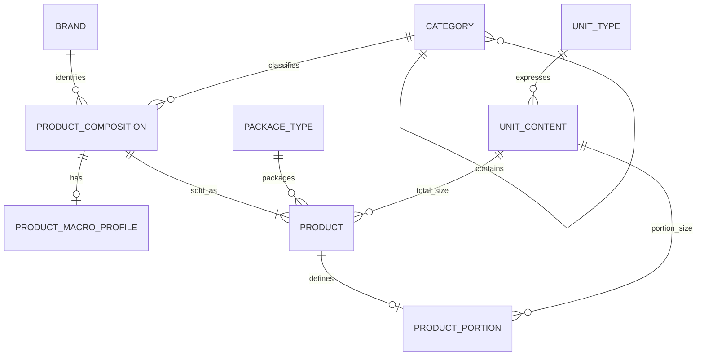

# Productcatalogus ERD — doelmodel

<!--
Documentatieregel: houd ERD's beperkt tot persistente tabellen, relaties en harde databaseconstraints.
Domeinregels, UI-gedrag, endpointcontracten en rationale horen in specs of domeindocs.
-->

Dit document beschrijft het doelmodel na de catalogusrevamp. Eén `product` is één concreet koopbaar en selecteerbaar item. De gedeelde inhoudelijke samenstelling staat in `product_composition`; er bestaat in het doelmodel geen afzonderlijke `product_package`-laag.

```yaml
brand
    id: uuid PK
    name: text NOT NULL
    UNIQUE (lower(trim(name)))

category
    id: int PK
    parent_id: int FK -> category.id NULL
    name: text NOT NULL
    UNIQUE (parent_id, lower(trim(name))) WHERE parent_id IS NOT NULL
    UNIQUE (lower(trim(name))) WHERE parent_id IS NULL

unit_type
    id: int PK autoincrement
    name: text NOT NULL
    symbol: text NOT NULL
    dimension: enum(MASS, VOLUME, COUNT) NOT NULL
    conversion_to_base: decimal NOT NULL
    CHECK (conversion_to_base > 0)
    UNIQUE (lower(trim(name)))
    UNIQUE (lower(trim(symbol)))

unit_content
    id: int PK autoincrement
    unit_type_id: int FK -> unit_type.id NOT NULL
    amount: decimal NOT NULL
    CHECK (amount > 0)
    UNIQUE (unit_type_id, amount)

package_type
    id: int PK autoincrement
    singular_name: text NOT NULL
    plural_name: text NOT NULL
    CHECK (length(trim(singular_name)) > 0)
    CHECK (length(trim(plural_name)) > 0)
    UNIQUE (lower(trim(singular_name)))
    UNIQUE (lower(trim(plural_name)))

product_composition
    id: uuid PK
    name: text NOT NULL
    category_id: int FK -> category.id NOT NULL
    brand_id: uuid FK -> brand.id NULL
    consumption_type: enum(FOOD, DRINK, SUPPLEMENT) NULL
    created_at: timestamp with time zone NOT NULL
    updated_at: timestamp with time zone NOT NULL

    UNIQUE (brand_id, category_id, lower(trim(name))) WHERE brand_id IS NOT NULL
    UNIQUE (category_id, lower(trim(name))) WHERE brand_id IS NULL

product_macro_profile
    product_composition_id: uuid PK FK -> product_composition.id ON DELETE CASCADE
    reference_basis: enum(PER_100_G, PER_100_ML, PER_UNIT) NOT NULL
    is_active: boolean NOT NULL DEFAULT true
    calories_kcal: decimal NULL
    protein_g: decimal NULL
    carbohydrates_g: decimal NULL
    fat_g: decimal NULL
    calories_source: enum(AUTOMATIC, MANUAL) NULL
    created_at: timestamp with time zone NOT NULL
    updated_at: timestamp with time zone NOT NULL

    CHECK (is_active IN (false, true))
    CHECK (calories_kcal IS NULL OR calories_kcal >= 0)
    CHECK (protein_g IS NULL OR protein_g >= 0)
    CHECK (carbohydrates_g IS NULL OR carbohydrates_g >= 0)
    CHECK (fat_g IS NULL OR fat_g >= 0)
    CHECK (
        COALESCE(calories_kcal, 0) > 0 OR
        COALESCE(protein_g, 0) > 0 OR
        COALESCE(carbohydrates_g, 0) > 0 OR
        COALESCE(fat_g, 0) > 0
    )
    CHECK (
        (calories_kcal IS NULL AND calories_source IS NULL) OR
        (calories_kcal IS NOT NULL AND calories_source IS NOT NULL)
    )

product
    id: uuid PK
    product_composition_id: uuid FK -> product_composition.id NOT NULL
    package_type_id: int FK -> package_type.id NULL
    unit_content_id: int FK -> unit_content.id NULL
    image_url: text NULL
    barcode: text NULL
    archived_at: timestamp with time zone NULL
    created_at: timestamp with time zone NOT NULL
    updated_at: timestamp with time zone NOT NULL

    UNIQUE (barcode) WHERE barcode IS NOT NULL
    UNIQUE (product_composition_id, package_type_id, unit_content_id)
        WHERE package_type_id IS NOT NULL AND unit_content_id IS NOT NULL

product_portion
    product_id: uuid PK FK -> product.id ON DELETE CASCADE
    singular_name: text NOT NULL
    plural_name: text NOT NULL
    unit_content_id: int FK -> unit_content.id NOT NULL
    portions_per_product: int NULL

    CHECK (length(trim(singular_name)) > 0)
    CHECK (length(trim(plural_name)) > 0)
    CHECK (portions_per_product IS NULL OR portions_per_product > 0)
```

## Relaties



## Migratiebron

Het oude `product` wordt standaard één `product_composition`; iedere oude `product_package` wordt één nieuw `product`. Bestaande consumptietypen blijven ongewijzigd. Het oude macroprofiel verhuist naar `product_macro_profile.product_composition_id` en start actief. Voor roots met meerdere verpakkingen wordt vóór migratie een rapport gemaakt om afwijkende samenstellingen handmatig te kunnen splitsen.
