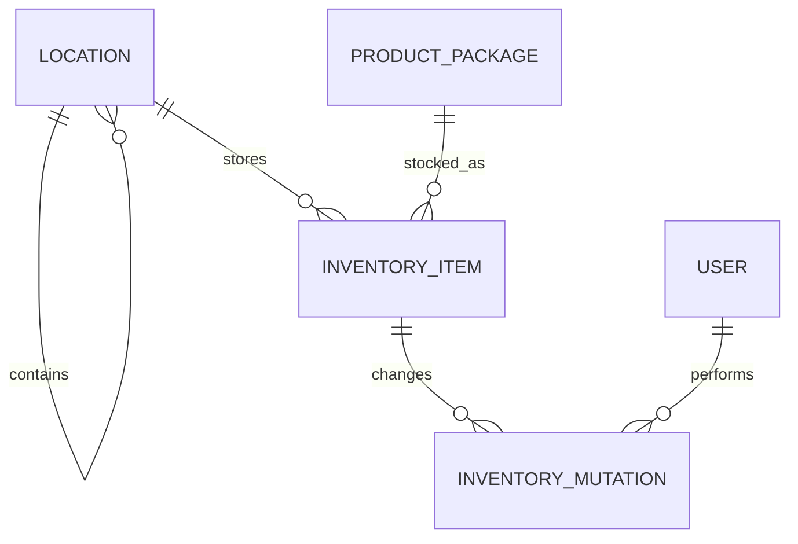

# Storage / inventory ERD

<!--
Documentatieregel: houd ERD's beperkt tot persistente tabellen, relaties en harde databaseconstraints.
Domeinregels, UI-gedrag, endpointcontracten en rationale horen in specs of domeindocs; verwijs hier alleen kort wanneer dat nodig is.
-->

Dit document beschrijft de persistente structuur van opbergplaatsen en voorraad. Gedeelde locatieregels staan in [opbergplaatsen-domeinregels.md](../../domein/opbergplaatsen-domeinregels.md); voorraadgedrag staat in de [inventory client-specificaties](../../specs/inventory-client/inventory-client-specificatie.md).

```yaml
location
    id: int PK autoincrement
    parent_id: int FK -> location.id ON DELETE RESTRICT NULL
    name: text NOT NULL
    normalized_name: text NOT NULL
    archived_at: timestamp with time zone NULL
    created_at: timestamp with time zone NOT NULL
    updated_at: timestamp with time zone NOT NULL

    # normalized_name is de door de write-laag gecanonicaliseerde naam voor
    # hoofdletterongevoelige sibling-uniciteit, inclusief rootlocaties.
    CHECK (length(name) BETWEEN 1 AND 100)
    CHECK (length(normalized_name) BETWEEN 1 AND 100)
    CHECK (parent_id IS NULL OR parent_id <> id)
    UNIQUE (normalized_name) WHERE parent_id IS NULL
    UNIQUE (parent_id, normalized_name) WHERE parent_id IS NOT NULL

inventory_item
    id: uuid PK
    product_package_id: int FK -> product_package.id NOT NULL
    location_id: int FK -> location.id ON DELETE RESTRICT NOT NULL
    expiry_date: date NULL
    quantity: int NOT NULL
    version: int NOT NULL
    created_at: timestamp with time zone NOT NULL
    updated_at: timestamp with time zone NOT NULL

    # Quantity counts complete packages; it is a positive whole number while a
    # batch exists and may remain at 0 as a hidden, reusable row.
    CHECK (quantity >= 0)
    CHECK (version >= 0)

    # A batch is unique per product package + location + expiry date. `NULL`
    # means no known expiry date and needs a complementary partial index.
    UNIQUE (product_package_id, location_id, expiry_date)
    UNIQUE (product_package_id, location_id) WHERE expiry_date IS NULL

inventory_mutation
    id: uuid PK
    inventory_item_id: uuid FK -> inventory_item.id NOT NULL
    kind: enum(ADD, REMOVE, SET, MOVE, DATE_CHANGE) NOT NULL
    quantity_delta: int NULL
    resulting_quantity: int NOT NULL
    from_location_id: int FK -> location.id ON DELETE RESTRICT NULL
    to_location_id: int FK -> location.id ON DELETE RESTRICT NULL
    from_expiry_date: date NULL
    to_expiry_date: date NULL
    user_id: text FK -> user.id NOT NULL
    created_at: timestamp with time zone NOT NULL

    # Moves and date changes are recorded on the source batch with the target
    # values in the to_* columns; the target-side merge records its own row.
    CHECK (resulting_quantity >= 0)
    CHECK (kind IN ('ADD', 'REMOVE', 'SET', 'MOVE', 'DATE_CHANGE'))
```

## Relaties



## Legacy-opslag

Migratie `0009_inventory_backend` vervangt de legacytabel `storage_record` door `inventory_item`. Legacyregels verwijzen alleen naar een product en bevatten geen eenduidige productverpakking; daarom worden ze niet automatisch geconverteerd.
