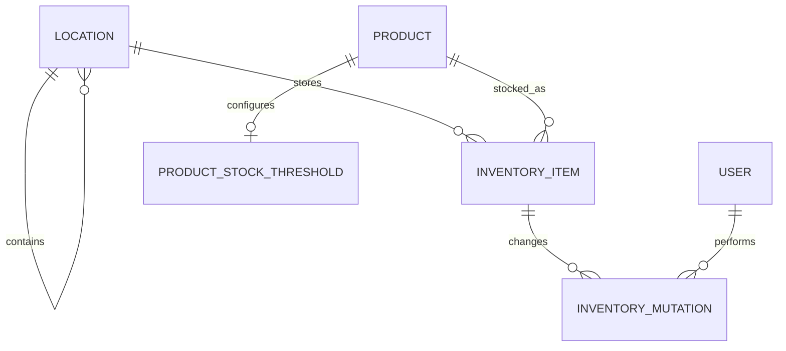

# Storage / inventory ERD — doelmodel

Dit document beschrijft opbergplaatsen en voorraad na de productcatalogusrevamp. Gedragsregels staan in [inventory-domeinregels.md](../../domein/inventory-domeinregels.md). Iedere `inventory_item` is één fysieke gekochte verpakking. De UI mag volledige identieke items groeperen, maar persistente items blijven afzonderlijk aanpasbaar.

```yaml
location
    id: int PK autoincrement
    parent_id: int FK -> location.id ON DELETE RESTRICT NULL
    name: text NOT NULL
    normalized_name: text NOT NULL
    archived_at: timestamp with time zone NULL
    created_at: timestamp with time zone NOT NULL
    updated_at: timestamp with time zone NOT NULL

    CHECK (length(name) BETWEEN 1 AND 100)
    CHECK (length(normalized_name) BETWEEN 1 AND 100)
    CHECK (parent_id IS NULL OR parent_id <> id)
    UNIQUE (normalized_name) WHERE parent_id IS NULL
    UNIQUE (parent_id, normalized_name) WHERE parent_id IS NOT NULL

inventory_item
    id: uuid PK
    product_id: uuid FK -> product.id NOT NULL
    location_id: int FK -> location.id ON DELETE RESTRICT NOT NULL
    expiry_date: date NULL
    remaining_amount_base: decimal NOT NULL
    version: int NOT NULL
    created_at: timestamp with time zone NOT NULL
    updated_at: timestamp with time zone NOT NULL

    # Stored in the base unit of the product content dimension: g, ml or count.
    # The maximum is derived live from product.unit_content_id.
    CHECK (remaining_amount_base > 0)
    CHECK (version >= 0)

inventory_mutation
    id: uuid PK
    inventory_item_id: uuid FK -> inventory_item.id NOT NULL
    kind: enum(ADD, CONTENT_SET, MOVE, DATE_CHANGE, REMOVE) NOT NULL
    amount_delta_base: decimal NULL
    resulting_amount_base: decimal NOT NULL
    from_location_id: int FK -> location.id ON DELETE RESTRICT NULL
    to_location_id: int FK -> location.id ON DELETE RESTRICT NULL
    from_expiry_date: date NULL
    to_expiry_date: date NULL
    user_id: text FK -> user.id NOT NULL
    created_at: timestamp with time zone NOT NULL

    CHECK (resulting_amount_base >= 0)
    CHECK (kind IN ('ADD', 'CONTENT_SET', 'MOVE', 'DATE_CHANGE', 'REMOVE'))

product_stock_threshold
    product_id: uuid PK FK -> product.id ON DELETE CASCADE
    low_stock_amount_base: decimal NOT NULL
    movement_class: enum(SLOW, MEDIUM, FAST) NULL
    updated_at: timestamp with time zone NOT NULL
    CHECK (low_stock_amount_base >= 0)
```

## Relaties



## Migratie

Een oude partij met `quantity = N` wordt uitgebreid naar `N` fysieke `inventory_item`-rijen. Iedere rij verwijst via de migratiemapping van `product_package.id` naar het nieuwe `product.id`, behoudt locatie en THT en start met de volledige productinhoud als `remaining_amount_base`.
